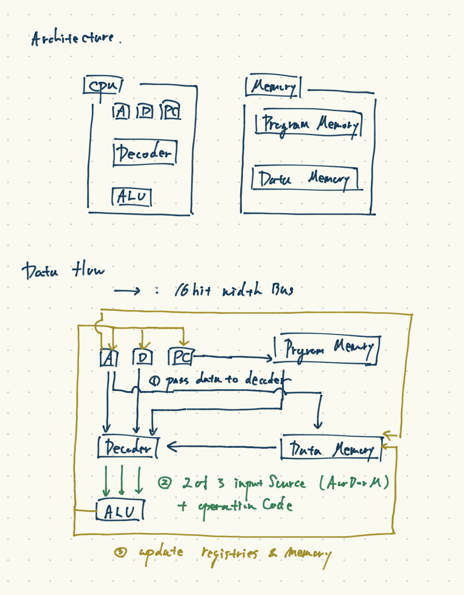

## What is this project
In this project, I'm building a computer machine emulator with assuming only dff-element and nand-element are provided.

It's based on the [https://www.nand2tetris.org/](https://www.nand2tetris.org/) course and textbook, 
but I choosed to use golang to build this project and modified some points so that I can emulate how computers works virtually.

This project codes include:
- Hardware layer, 
- Assembler layer, 
- VM layer 


## built components
- Hardware
    - [x] logic gates
        - only nand is given. this means that only nand struct can use Golang's if condition
        - and, or, not, nor, multi_plexer, xor, or_16_to_1
        - multibit_{and, or, not, nor, multi_plexer. to_1_multi_plexer}
    - [x] ALU, instruction decoder, comp/dest/jump decoder
    - [x] memory
        - only dff is given. 
        - flipflop, word, memory, register
    - [x] cpu
        - composed of registers(only two registers) + ALU + decoders + multi plexer 
    - [x] computer
        - cpu + 2 memory units 
- Assembler
    - [x] interpreter from Assemble language to binary code
- VM
    - [x] interface design
        - 8 memory segments
        - stack machine
    - [x] VM implementation
        - [x] translater 
        - ... supports
            - push/pop
            - operand: add/sub/and/or/not/eq/lt/gt/neq
            - control flow: label/goto/if_goto
            - function: function/return/call

## spec of hardware layer
### components architecture



### instructions
Hardware layer has 2 types of instructions
#### 1. A command
format = `0vvvvvvvvvvvvvvv`

This set the value in A registry.

ex. 0000000000000110
this sets 6 in A registry.

#### 2. C command
format = `111accccccdddjjj`

This does 3things
    1. calc value based on A registry, D registry and Memory
    2. set the value if dest is given
    3. jump to the address current A registry has if jump is given

##### dest options
| ddd | desc                    | 
|-----|-------------------------| 
| 000 | dest is not given.      | 
| 100 | dest is A               | 
| 010 | dest is D               | 
| 001 | dest is M               | 
| 110 | dest is AD(A and D)     | 
| 011 | dest is DM(D and M)     | 
| 101 | dest is AM(A and M)     | 
| 111 | dest is ADM(A, D and M) | 


##### comp options 
we have 18 comp options. It's corresponding to ALU's operationCodes.
blank cells are not defined

| cccccc | a=0  | a=1  | 
|--------|------|------| 
| 101010 | 0    |      | 
| 111111 | 1    |      | 
| 111010 | -1   |      | 
| 001100 | D    |      | 
| 110000 | A    | M    | 
| 001101 | !D   |      | 
| 110001 | !A   | !M   | 
| 001111 | -D   |      | 
| 110011 | -A   | -M   | 
| 011111 | D+1  |      | 
| 110111 | A+1  | M+1  | 
| 001110 | D-1  |      | 
| 110010 | A-1  | M-1  | 
| 000010 | D+A  | D+M  | 
| 010011 | D-A  | D-M  | 
| 000111 | A-D  | M-D  | 
| 000000 | D&A  | D&M  | 
| 010101 | D\|A | D\|M | 


##### jump options
| jjj | desc                    | 
|-----|-------------------------| 
| 000 | no jump                 | 
| 001 | JGT. jump if A reg > 0  | 
| 010 | JEQ. jump if A reg == 0 | 
| 011 | JGE. jump if A reg >= 0 | 
| 100 | JLT. jump if A reg < 0  | 
| 101 | JNE. jump if A reg != 0 | 
| 110 | JLE. jump if A reg <= 0 | 
| 111 | JMP. jump anyway        | 


## spec of assembler layer
assembler syntax is corresponding to the spec of hardware layer.
In addition, it provides AddressTaggingStatement(≒ label statement).

### syntax format
#### Acommand
format = `@val`
we can pass variable or int in `val` place.  
i.g. `@123` `@sum`

#### Ccommand
format = `(dest=)comp;(jump)`

- dest: OPTIONAL
    - where the result of comp goes to.
    - 8 options. A?D?M?
- comp: REQUIRED
    - what calculation is executed
    - 18 * 2 options.
        - SEE [comp options](#)
- jump: OPTIONAL
    - which comparison operand to use to decide jump or not
    - 8 options.
        - SEE [jump options](#)

#### example
a sample code which sums up 1 to 10
you can see other samples in `sample_asm/`
```
@10
D=A;
@i
M=D;
@sum
M=0;
(LOOP)
    // sum = sum + i
    @sum
    D=M;
    @i
    D=D+M;
    @sum
    M=D;
    // i = i - 1
    @i
    M=M-1;
    D=M;
    @END
    D;JEQ
    @LOOP
    0;JMP
(END)
@sum
D=M;
(END_LOOP)
@END_LOOP
0;JMP
```

## spec of VM layer
This VM is stack machine.
With 8 memory segments and one stack, it allows us to compute without hardware knowledge.

It provides these syntaxes for high-level language's frontend compiler,
and this implementation work as high-level language's backend compiler.

- comparison operands
    - pop 2 elements and push boolean value: 1(true) or 0(false)
    - operands
        - `eq`
        - `gt`
        - `lt`
- calculation operands
    - pop 2 elements, calc the result and push 
    - operands
        - `add`
        - `sub`
        - `and`
        - `or`
    - pop 1 element, calc the result and push 
    - operand
        - `not`
- control flow
    - `label {label}`
    - `goto {label}`
    - `if_goto {label}`
        - based on the top value of the stack, jump to labeled line.
- function
    - `function {funcName} {localVariablesNum}`
    - `return`
    - `call {funcName} {argVariablesNum}`


### example
a sample code which calculates `123 + 1*2*3*4`
you can see other samples in `sample_vm/`
```
// This vm script will calculate 123 + 1*2*3*4
push constant 123
goto multiple_end
function multiple 2
    // local[0]: i = arg[1]
    push argument 1
    pop local 0

    // local[0]: sum = 0
    push constant 0
    pop local 1

    // this does for-loop virtually
    // label multiple_of
    // if (i == 0) {
    //   return sum
    // } else {
    //   sum = sum + arg[0]
    //   i = i - 1
    //   goto multiple_if
    //}
    label multiple_if
    push local 0
    push constant 0
    eq
    if_goto multiple_if_then
        push local 1
        push argument 0
        add
        pop local 1
        push local 0
        push constant 1
        sub
        pop local 0
        goto multiple_if
    label multiple_if_then
        push local 1
        return
label multiple_end
push constant 1
push constant 2
call multiple 2
push constant 3
call multiple 2
push constant 4
call multiple 2
add
```
